# SmartPRDProcessor - 2-Stage Smart Analysis

The SmartPRDProcessor uses an intelligent 2-stage approach to efficiently process PRD changes and manage issues while avoiding unnecessary updates.

## 🎯 Stage 1: Comprehensive Planning
**Purpose**: Unified analysis that combines change assessment, issue analysis, and feature gap identification

```mermaid
graph TD
    A[📋 PRD Content + Diff] --> B[🔍 Smart Change Detection]
    B --> C{Change Significance}
    C -->|Trivial| D[❌ Skip Processing]
    C -->|Significant| E[🤖 Unified AI Analysis]
    E --> F[📊 Comprehensive Plan]
    F --> G[📝 Issue Updates]
    F --> H[🆕 New Features]
    F --> I[✅ No Changes Needed]
```

**Smart Change Detection**:
- **Filters trivial changes**: Version numbers, dates, formatting
- **Identifies significant changes**: New features, requirement changes, scope modifications
- **Early exit**: If only trivial changes detected, processing stops here

**Input**:
- Current PRD content
- PRD diff (filtered for significance)
- All existing issues with full content

**Unified AI Analysis**:
- Single AI call that sees the complete context
- Avoids conflicts between separate analysis stages
- Makes holistic decisions about updates vs new issues

**Output**:
- **Change Assessment**: Significance evaluation and reasoning
- **Issue Update Plans**: For each existing issue:
  - `update` - Specific changes needed
  - `obsolete` - Mark as outdated
  - `no_change` - Remains current
- **New Features**: Only genuinely new functionality not covered by updates
- **Summary**: Overall rationale and processing statistics

**AI Analysis**: Uses `prd-unified-planning.md` prompt for comprehensive analysis

---

## ⚡ Stage 2: Change Execution
**Purpose**: Execute the validated plan from Stage 1

```mermaid
graph TD
    A[📊 Comprehensive Plan] --> B{Issue Updates}
    B -->|Update| C[🔄 Modify Issues]
    B -->|Obsolete| D[🗑️ Mark Obsolete]
    B -->|No Change| E[✅ Leave Unchanged]

    A --> F[🆕 Create New Issues]

    C --> G[📊 Execution Summary]
    D --> G
    E --> G
    F --> G
    G --> H[✅ Complete]
```

**Execution Process**:
- **Issue Updates**: Apply planned changes with comments and reasoning
- **New Issue Creation**: Only for features not covered by updates
- **PRD Version Storage**: Link issues to current PRD state
- **Comprehensive Logging**: Track all decisions and changes

**Benefits of 2-Stage Approach**:
- **Reduced false positives**: Smart filtering prevents unnecessary updates
- **Holistic decisions**: AI sees complete context in single analysis
- **Fewer API calls**: 1 planning call instead of 3 separate analyses
- **Better consistency**: No conflicts between separate stages

---

## 🔄 Complete Workflow

```mermaid
graph TD
    START[📄 PRD Processing] --> LOAD[📥 Load Existing Issues]
    LOAD --> DIFF[📊 Generate PRD Diff]

    DIFF --> DETECT[🔍 Smart Change Detection]
    DETECT -->|Trivial Only| SKIP[❌ Skip - No Significant Changes]
    DETECT -->|Significant| S1[🎯 Stage 1: Comprehensive Planning]

    S1 --> PLAN[📊 Unified Analysis Result]
    PLAN --> S2[⚡ Stage 2: Change Execution]
    S2 --> SUMMARY[📊 Enhanced Summary]
    SUMMARY --> END[✅ Processing Complete]

    SKIP --> END
```

## 📊 Enhanced Output Summary

After the 2-stage process completes, the processor provides:

- **Change Assessment**: Significance analysis with filtered trivial changes
- **Updated Issues**: Count of existing issues modified with reasoning
- **Created Issues**: Count of new issues created (only when genuinely needed)
- **Unchanged Issues**: Count of issues that needed no updates
- **Processing Efficiency**: Early exit for trivial-only changes
- **Enhanced Traceability**: Complete reasoning for all decisions

## 🎯 Key Benefits of 2-Stage Approach

1. **Eliminates Over-Processing** - Smart filtering prevents unnecessary updates for trivial changes
2. **Holistic Decision Making** - Single AI analysis sees complete context, preventing conflicts
3. **Reduced API Costs** - 1 comprehensive AI call instead of 3 separate analyses
4. **Better Accuracy** - Unified view prevents duplicate or conflicting decisions
5. **Faster Processing** - Early exit for version-number-only changes
6. **Enhanced Logging** - Clear reasoning for why changes were/weren't made
7. **Improved User Experience** - Less noise, more signal in issue updates

## 🔍 Problem Solving

**Previous Issues with 3-Stage Approach**:
- Minor changes triggered full processing pipeline
- Separate stages made conflicting decisions
- Over-creation of issues and unnecessary updates
- High API token usage for trivial changes

**Solutions in 2-Stage Approach**:
- **Smart pre-filtering** catches trivial changes before AI analysis
- **Unified planning** ensures consistent decisions across all issues
- **Conservative approach** prefers updates over new issue creation
- **Early termination** saves resources on insignificant changes